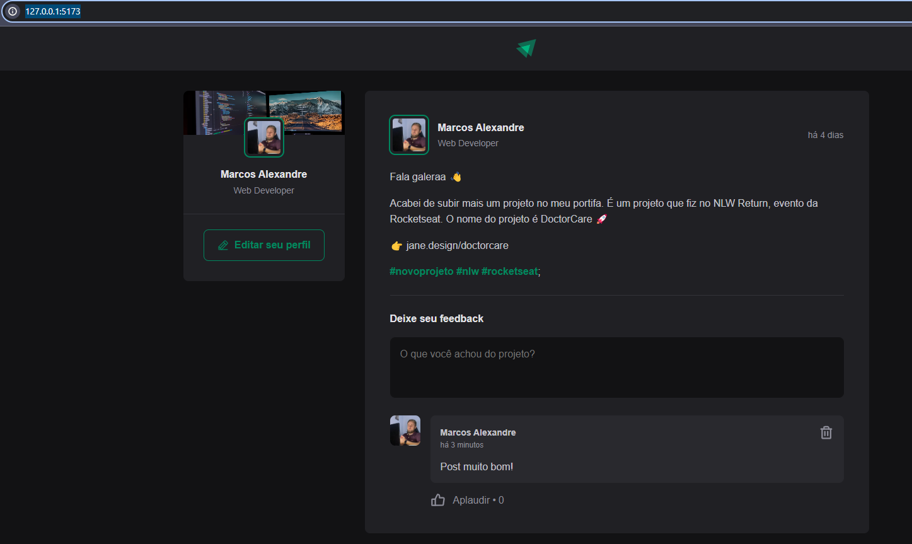

# Projeto: Ignite Feed

O projeto Ignite Feed é uma plataforma de compartinhamento de conteúdo que visa fornecer aos usuários uma maneira conveniente visualizar/comentar/publicar informações relevantes.  

## 🚀 Começando

Essas instruções permitirão que você obtenha uma cópia do projeto em operação na sua máquina local para fins de desenvolvimento e teste.

## Acesse o projeto

Você pode acessar o projeto hospedado [aqui](https://feed-react-ts-theta.vercel.app/).


### 🔧 Instalação

Clone do repositorio:

```
https://github.com/anjosmarcos/feed-react-ts.git
```

Executar com o comando:
```
npm run dev
```

Em seu navegador de sua preferencia usar o link de comando:
```
http://127.0.0.1:5173/
```	




## 📦 Implantação

Adicione notas adicionais sobre como implantar isso em um sistema ativo

### 📦 Usan Docker para testar a aplicação 


#### Como usar

Faça o pull da imagem Docker:

```
   docker pull devmarcosanjos/feed-ignite-ts
```

Faça o pull da imagem Docker:

```
docker run -d --name meu_container -p 8080:5173 devmarcosanjos/feed-ignite
``` 

Acesse a aplicação em:

```
http://localhost:8080
``` 

## 🛠️ Construído com

As tecnologias utilizadas foram:

* [ReactJS](https://reactjs.org/) - Biblioteca JavaScript para construção de interfaces de usuário
* [JavaScript](https://developer.mozilla.org/pt-BR/docs/Web/JavaScript) - Linguagem de programação de alto nível e dinâmica
* [TypeScript](https://www.typescriptlang.org/) - Superset JavaScript que adiciona tipagem estática opcional ao JavaScript
* [HTML](https://developer.mozilla.org/pt-BR/docs/Web/HTML) - Linguagem de marcação para construção de páginas web
* [CSS](https://developer.mozilla.org/pt-BR/docs/Web/CSS) - Linguagem de estilização para páginas web
* [Phosphor Icons](https://phosphoricons.com/) - Conjunto de ícones para uso em projetos web
* [date-fns](https://date-fns.org/) - Biblioteca JavaScript para manipulação de datas

## 📌 Versão

Nós usamos [SemVer](http://semver.org/) para controle de versão. Para as versões disponíveis, observe as [tags neste repositório](https://github.com/suas/tags/do/projeto). 


## 📄 Licença

Esse projeto está sob a licença MIT.

## 🎁 Expressões de gratidão

Gostaria de agradecer especialmente ao Diego Fernandes da RockSeat pelos ensinamentos para o desenvolvimento deste projeto.


---
⌨️ com ❤️ por [Marcos Anjos](https://singlebio.link/marcosanjos) 😊